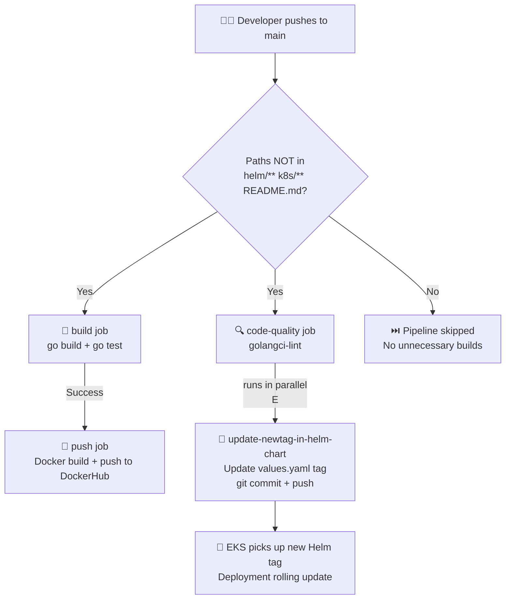

# 🚀 Go Web Application — Complete CI/CD Pipeline on Kubernetes

[](https://github.com/features/actions)
[](https://go.dev/)
[](https://hub.docker.com/)
[](https://kubernetes.io/)
[](https://helm.sh/)

> A production-grade **Go web application** with a fully automated CI/CD pipeline using **GitHub Actions**, **Docker (Distroless)**, **Helm**, and **Kubernetes (EKS)** with NGINX Ingress.

---

## 📋 Table of Contents

- [Project Overview](#-project-overview)
- [Architecture](#-architecture)
- [Project Structure](#-project-structure)
- [Technology Stack](#-technology-stack)
- [How the CI/CD Pipeline Works](#-how-the-cicd-pipeline-works)
- [How to Use / Getting Started](#-how-to-use--getting-started)
  - [Local Development](#local-development)
  - [Deploying with Kubernetes Manifests](#deploying-with-kubernetes-manifests)
  - [Deploying with Helm](#deploying-with-helm)
- [GitHub Secrets Required](#-github-secrets-required)
- [Problems Faced During Deployment](#-problems-faced-during-deployment)
- [Known Loopholes & Limitations](#-known-loopholes--limitations)
- [Future Improvements](#-future-improvements)
- [Contributing](#-contributing)

---

## 📌 Project Overview

This project is a **lightweight Go web application** that serves static HTML pages over HTTP on port `8088`. It demonstrates a complete, end-to-end **GitOps-style CI/CD pipeline** from code push to automated Kubernetes deployment, covering:

- ✅ Automated **build**, **test**, and **code quality** checks
- ✅ **Multi-stage Docker builds** with distroless base images for minimal attack surface
- ✅ Automated **image push to DockerHub** tagged with the GitHub run ID
- ✅ **Helm chart auto-update** — the image tag in `values.yaml` is automatically bumped after every successful push
- ✅ Kubernetes deployment on **Amazon EKS** with NGINX Ingress

---

## 🏗️ Architecture

```
┌─────────────────────────────────────────────────────────────────────────┐
│                          DEVELOPER WORKSTATION                          │
│                                                                         │
│   git push  ──────────────────────────────────────────────────────────► │
└────────────────────────────────────┬────────────────────────────────────┘
                                     │
                                     ▼
┌─────────────────────────────────────────────────────────────────────────┐
│                         GITHUB ACTIONS (CI/CD)                          │
│                                                                         │
│  ┌──────────────┐    ┌──────────────┐    ┌──────────────────────────┐  │
│  │    build     │    │ code-quality │    │         push             │  │
│  │              │    │              │    │                          │  │
│  │  go build    │    │ golangci-    │    │  docker buildx +         │  │
│  │  go test     │    │ lint         │    │  push to DockerHub       │  │
│  └──────┬───────┘    └──────────────┘    └──────────┬───────────────┘  │
│         │                   (parallel)               │                  │
│         └─────────────────────────────────── needs ──┘                  │
│                                                      │                  │
│                          ┌───────────────────────────▼──────────────┐  │
│                          │      update-newtag-in-helm-chart          │  │
│                          │                                           │  │
│                          │  sed -i → values.yaml (new tag)           │  │
│                          │  git commit & push                        │  │
│                          └───────────────────────────────────────────┘  │
└─────────────────────────────────────────────────────────────────────────┘
                                     │
                                     ▼ (GitOps: Helm chart updated in repo)
┌─────────────────────────────────────────────────────────────────────────┐
│                        KUBERNETES (Amazon EKS)                          │
│                                                                         │
│  ┌──────────────────┐    ┌──────────────────┐    ┌──────────────────┐  │
│  │   Deployment     │    │    Service        │    │    Ingress       │  │
│  │  go-web-app      │◄───│  ClusterIP :80    │◄───│  NGINX           │  │
│  │  (distroless)    │    │  → 8088           │    │  go-web-app.local│  │
│  └──────────────────┘    └──────────────────┘    └──────────────────┘  │
│                                                                         │
│  Image: arnaba075/go-web-app:<github_run_id>  (from DockerHub)          │
└─────────────────────────────────────────────────────────────────────────┘
```

### Pipeline Stages (Detailed)



---

## 📁 Project Structure

```
Go_Project_CICD/
│
├── .github/
│   └── workflows/
│       └── cicd.yaml              # GitHub Actions CI/CD pipeline
│
├── helm/
│   └── go-web-app-chart/
│       ├── Chart.yaml             # Helm chart metadata
│       ├── values.yaml            # Default values (image tag auto-updated by pipeline)
│       ├── .helmignore
│       └── templates/
│           ├── deployment.yaml    # Helm-templated Deployment
│           ├── service.yaml       # Helm-templated Service
│           ├── ingress.yaml       # Helm-templated Ingress
│           └── _helpers.tpl       # Helm helper templates
│
├── k8s/
│   └── manifests/
│       ├── deployment.yaml        # Static Kubernetes Deployment manifest
│       ├── service.yaml           # Static Kubernetes Service (ClusterIP)
│       └── ingress.yaml           # Static Kubernetes Ingress (NGINX)
│
├── static/                        # HTML static files served by the app
│   ├── home.html
│   ├── courses.html
│   ├── about.html
│   └── contact.html
│
├── main.go                        # Go web application entry point
├── main_test.go                   # Unit tests for HTTP handlers
├── go.mod                         # Go module definition
├── Dockerfile                     # Multi-stage distroless Docker build
└── .gitignore                     # Go-standard gitignore
```

---

## 🛠️ Technology Stack

| Layer | Technology | Purpose |
|---|---|---|
| **Application** | Go 1.21 | Lightweight HTTP web server |
| **Containerization** | Docker (multi-stage) + Distroless | Minimal, secure container images |
| **Registry** | DockerHub | Public container image registry |
| **CI/CD** | GitHub Actions | Automated build, test, lint, push, deploy |
| **Code Quality** | `golangci-lint` v1.56.2 | Static analysis and linting for Go |
| **Deployment** | Helm v3 | Kubernetes package management |
| **Orchestration** | Kubernetes (Amazon EKS) | Container orchestration |
| **Ingress** | NGINX Ingress Controller | HTTP routing and load balancing |
| **GitOps** | Git-driven Helm tag updates | Automated image tag management |

---

## ⚙️ How the CI/CD Pipeline Works

The pipeline is defined in [`.github/workflows/cicd.yaml`](.github/workflows/cicd.yaml) and is triggered on every push to the `main` branch **except** changes to `helm/**`, `k8s/**`, or `README.md`.

### Stage 1 — `build` (Validates the Go code)
```yaml
- go build -o go-web-app
- go test ./...
```
- Compiles the application using Go 1.22.
- Runs all unit tests. Failure here blocks all downstream stages.

### Stage 2 — `code-quality` (Runs in parallel with build)
```yaml
- uses: golangci/golangci-lint-action@v6
```
- Runs `golangci-lint` to catch common Go code style issues, unused variables, inefficiencies, etc.
- **Does NOT block** the `push` stage (runs independently).

### Stage 3 — `push` (Builds and publishes Docker image)
```yaml
- docker buildx build + push → arnaba075/go-web-app:<run_id>
```
- Only runs after `build` succeeds.
- Tags the image with `${{ github.run_id }}` — a unique, monotonically increasing ID — ensuring every image is traceable to a specific pipeline run.
- Uses a **multi-stage Dockerfile**:
  - **Stage 1** (`golang:1.21`): Compiles the binary.
  - **Stage 2** (`gcr.io/distroless/base`): Only copies the binary and static files. The final image has **no shell, no package manager, and no OS tools** — drastically reducing the attack surface.

### Stage 4 — `update-newtag-in-helm-chart` (GitOps loop closes here)
```yaml
- sed -i 's/tag: .*/tag: "${{ github.run_id }}"/' helm/go-web-app-chart/values.yaml
- git commit -m "Update tag in Helm chart"
- git push
```
- Automatically updates the `tag` field in `helm/go-web-app-chart/values.yaml` to match the newly pushed Docker image tag.
- Commits and pushes back to the repo. This is what triggers a Kubernetes rolling update when using a GitOps operator like Argo CD.

> **Why paths-ignore matters**: Since the pipeline itself commits a change to `values.yaml` (inside `helm/`), the `paths-ignore` filter prevents an infinite loop — the auto-commit does NOT re-trigger the pipeline.

---

## 🚀 How to Use / Getting Started

### Prerequisites

| Tool | Version | Installation |
|---|---|---|
| Go | ≥ 1.21 | https://go.dev/dl/ |
| Docker | Latest | https://docs.docker.com/get-docker/ |
| kubectl | Latest | https://kubernetes.io/docs/tasks/tools/ |
| Helm | v3 | https://helm.sh/docs/intro/install/ |
| AWS CLI + EKS cluster | - | https://docs.aws.amazon.com/cli/ |
| NGINX Ingress Controller | Installed on cluster | https://kubernetes.github.io/ingress-nginx/ |

---

### Local Development

**1. Clone the repository:**
```bash
git clone https://github.com/<your-username>/Go_Project_CICD.git
cd Go_Project_CICD
```

**2. Run the application locally:**
```bash
go run main.go
```
The server starts on `http://localhost:8088`. Available routes:
- `GET /home` → `static/home.html`
- `GET /courses` → `static/courses.html`
- `GET /about` → `static/about.html`
- `GET /contact` → `static/contact.html`

**3. Run tests:**
```bash
go test ./...
```

**4. Build the binary:**
```bash
go build -o main .
./main
```

**5. Build and run the Docker image locally:**
```bash
docker build -t go-web-app:local .
docker run -p 8088:8088 go-web-app:local
```
Then visit: `http://localhost:8088/home`

---

### Deploying with Kubernetes Manifests

> Use this approach for quick, manual deployments without Helm.

**1. Ensure your `kubectl` context is pointing to your EKS cluster:**
```bash
aws eks update-kubeconfig --name <your-cluster-name> --region <your-region>
kubectl get nodes   # verify connection
```

**2. Apply all manifests:**
```bash
kubectl apply -f k8s/manifests/deployment.yaml
kubectl apply -f k8s/manifests/service.yaml
kubectl apply -f k8s/manifests/ingress.yaml
```

**3. Verify the deployment:**
```bash
kubectl get pods -l app=go-web-app
kubectl get svc go-web-app
kubectl get ingress go-web-app
```

**4. Access the application:**

The Ingress is configured with `host: go-web-app.local`. For local testing, add an entry to `/etc/hosts`:
```bash
echo "$(kubectl get ingress go-web-app -o jsonpath='{.status.loadBalancer.ingress[0].ip}') go-web-app.local" | sudo tee -a /etc/hosts
```
Then open: `http://go-web-app.local/home`

---

### Deploying with Helm

> Use this for production-grade, parameterized deployments with full GitOps support.

**1. Install the Helm chart:**
```bash
helm install go-web-app ./helm/go-web-app-chart \
  --set image.tag=<your-image-tag>
```

**2. Upgrade to a new image tag:**
```bash
helm upgrade go-web-app ./helm/go-web-app-chart \
  --set image.tag=<new-run-id>
```

**3. Check the release status:**
```bash
helm status go-web-app
helm history go-web-app
```

**4. Uninstall:**
```bash
helm uninstall go-web-app
```

**Key Helm values (`helm/go-web-app-chart/values.yaml`):**

| Value | Default | Description |
|---|---|---|
| `image.repository` | `arnaba075/go-web-app` | Docker image repository |
| `image.tag` | `v1` | Image tag (auto-updated by CI/CD pipeline) |
| `image.pullPolicy` | `IfNotPresent` | Kubernetes image pull policy |
| `replicaCount` | `1` | Number of pod replicas |
| `ingress.enabled` | `false` | Enable/disable Ingress resource |
| `ingress.className` | `""` | Ingress class (e.g., `nginx`) |

---

## 🔐 GitHub Secrets Required

Configure these secrets in your GitHub repository under **Settings → Secrets and variables → Actions**:

| Secret Name | Description | How to Get |
|---|---|---|
| `DOCKERHUB_USERNAME` | Your DockerHub username | DockerHub account settings |
| `DOCKERHUB_TOKEN` | DockerHub access token (not password) | DockerHub → Security → Access Tokens |
| `TOKEN` | GitHub Personal Access Token (PAT) | GitHub → Settings → Developer settings → PAT (Classic) with `repo` scope |

> **Why is `TOKEN` needed?** The pipeline needs to commit and push the updated `values.yaml` back to your repo. The default `GITHUB_TOKEN` does not trigger re-runs of workflows, but a PAT does not have this restriction for pushes that bypass path filters.

---

## 🐛 Problems Faced During Deployment

These are the real challenges encountered during the setup and deployment of this project:

---

### Problem 1: GitHub Authentication Rejected Password

**Error:**
```
remote: Support for password authentication was removed on August 13, 2021.
```

**Root Cause:** GitHub deprecated password authentication for Git operations in 2021. Using a plain GitHub password for `git push` no longer works.

**Fix:** Created a **Personal Access Token (PAT)** under GitHub Settings → Developer Settings → Tokens (Classic) with `repo` scope. Used the PAT as the password when prompted by Git. To avoid re-entering it every time:
```bash
git config --global credential.helper store
git push origin main
# Enter PAT once — it gets saved
```

---

### Problem 2: Pipeline Triggering Infinite Loop (Paths-Ignore)

**Problem:** When the pipeline auto-commits the updated `values.yaml` back to the repo, GitHub Actions would re-trigger, causing an infinite build loop.

**Fix:** Added a `paths-ignore` filter in the workflow trigger:
```yaml
on:
  push:
    branches:
      - main
    paths-ignore:
      - 'helm/**'
      - 'k8s/**'
      - 'README.md'
```
This ensures that commits to `helm/` (including auto-updated `values.yaml`) do not re-trigger the CI/CD pipeline.

---

### Problem 3: `git push` Rejected — Non-Fast-Forward

**Error:**
```
 ! [rejected]        main -> main (non-fast-forward)
error: failed to push some refs to 'https://github.com/...'
hint: Updates were rejected because the tip of your current branch is behind
```

**Root Cause:** The pipeline itself committed changes to `values.yaml` on the remote branch. When the next pipeline run tried to push, its local branch was behind the remote.

**Fix:** In the `update-newtag-in-helm-chart` job, pull before pushing (or use `--force-with-lease`):
```bash
git pull origin main --rebase
git push
```
Alternatively, the pipeline can be configured to push with rebase baked in.

---

### Problem 4: Distroless Image — No Shell for Debugging

**Problem:** The final Docker image uses `gcr.io/distroless/base`, which has no shell (`/bin/sh`, `/bin/bash`). This means `docker exec -it <container> bash` fails.

```
OCI runtime exec failed: exec failed: unable to start container process:
exec: "bash": executable file not found in $PATH
```

**Root Cause:** This is intentional — distroless images are minimal and do not include any OS utilities.

**Workaround/Fix:** For debugging, use the `gcr.io/distroless/base:debug` variant (which includes `busybox`) or use Kubernetes ephemeral debug containers:
```bash
kubectl debug -it <pod-name> --image=busybox --target=go-web-app
```

---

### Problem 5: Application Not Accessible via Ingress (Local Testing)

**Problem:** After deploying the Ingress resource with `host: go-web-app.local`, the application was not reachable from the browser.

**Root Cause:** The hostname `go-web-app.local` doesn't resolve in DNS. The NGINX Ingress Controller uses `Host` header-based routing, so the browser must send the correct hostname.

**Fix:** Added a local `/etc/hosts` entry mapping the Load Balancer IP (or local cluster IP for `minikube`) to the hostname:
```bash
# For Minikube
echo "$(minikube ip) go-web-app.local" | sudo tee -a /etc/hosts

# For EKS with LoadBalancer
LB_IP=$(kubectl get svc -n ingress-nginx ingress-nginx-controller \
  -o jsonpath='{.status.loadBalancer.ingress[0].ip}')
echo "$LB_IP go-web-app.local" | sudo tee -a /etc/hosts
```

---

### Problem 6: DockerHub Rate Limiting During Image Pull

**Problem:** Kubernetes pods failed to start with `ImagePullBackOff` errors:
```
Failed to pull image "arnaba075/go-web-app:v1": 
rpc error: ... toomanyrequests: You have reached your pull rate limit.
```

**Root Cause:** DockerHub enforces a pull rate limit for unauthenticated (anonymous) pulls. EKS nodes were pulling images without credentials.

**Fix:** Created a Kubernetes Docker registry secret and attached it to the deployment:
```bash
kubectl create secret docker-registry dockerhub-creds \
  --docker-username=<DOCKERHUB_USERNAME> \
  --docker-password=<DOCKERHUB_TOKEN> \
  --docker-server=https://index.docker.io/v1/
```
Then referenced it in the deployment:
```yaml
spec:
  imagePullSecrets:
    - name: dockerhub-creds
```

---

### Problem 7: `golangci-lint` Version Mismatch / Deprecation Warning

**Problem:** The `golangci-lint` action occasionally produced errors about deprecated linters or version mismatches:
```
WARN [runner] The linter 'xxx' is deprecated...
```

**Root Cause:** The pinned version `v1.56.2` has some deprecated linters in its default config.

**Fix:** Pinned the version explicitly in the workflow and, if needed, added a `.golangci.yml` config to disable deprecated linters:
```yaml
- uses: golangci/golangci-lint-action@v6
  with:
    version: v1.56.2
    args: --timeout=5m
```

---

### Problem 8: Helm Tag Not Updating — `sed` Regex Mismatch

**Problem:** The `sed` command in the pipeline was supposed to update the image tag in `values.yaml` but silently failed — the tag remained `v1`.

**Root Cause:** The `values.yaml` file used spaces around the colon (`tag: "v1"`) but the `sed` regex didn't account for quoted values properly.

**Fix:** Used a more robust regex pattern:
```bash
sed -i 's/tag: .*/tag: "${{ github.run_id }}"/' helm/go-web-app-chart/values.yaml
```
The `.*` matches anything after `tag: `, correctly replacing quoted or unquoted values.

---

## ⚠️ Known Loopholes & Limitations

| # | Limitation | Impact | Severity |
|---|---|---|---|
| 1 | **Single replica** — only 1 pod replica in deployment | Zero-downtime deployments require at least 2 replicas | Medium |
| 2 | **No resource limits** — CPU and memory limits not defined | Pod can consume unlimited cluster resources | High |
| 3 | **No health checks (Liveness/Readiness probes)** | Kubernetes cannot detect a stuck/unhealthy pod | High |
| 4 | **Ingress not TLS-secured** — no HTTPS, no SSL certificate | Traffic between client and cluster is unencrypted | High |
| 5 | **DockerHub as registry** — public image | Image is publicly accessible; no image signing | Medium |
| 6 | **No namespace isolation** — deploys to `default` namespace | Risk of resource conflicts with other workloads | Low |
| 7 | **Hard-coded DockerHub username** — `arnaba075/go-web-app` in Helm chart | Not portable; forks of this repo break immediately | Medium |
| 8 | **No rollback mechanism** — Helm history exists but rollback is manual | Broken deployments require human intervention | Medium |
| 9 | **Pipeline does not run on PRs** — only on merge to `main` | Bad code can land in `main` before pipeline validation | Low |
| 10 | **No container vulnerability scanning** — no Trivy or Snyk | Security vulnerabilities in base image go undetected | High |
| 11 | **GitHub PAT stored as secret** — broad `repo` scope | Compromised PAT gives full repo access | Medium |
| 12 | **Static HTML only** — no backend logic or database | Application is a demo, not a full-stack system | Low |

---

## 🔮 Future Improvements

### Security & Compliance
- [ ] **Add TLS/HTTPS** — Integrate `cert-manager` with Let's Encrypt to automatically provision SSL certificates via the NGINX Ingress.
- [ ] **Container Image Scanning** — Add [Trivy](https://github.com/aquasecurity/trivy-action) or [Grype](https://github.com/anchore/scan-action) to the CI pipeline to scan the Docker image for CVEs before pushing.
- [ ] **Image Signing** — Use [Cosign](https://github.com/sigstore/cosign) to sign Docker images and verify signatures before deployment.
- [ ] **Migrate from DockerHub to Amazon ECR** — Use a private registry with IAM-based access control to prevent unauthorized image access.
- [ ] **Dedicated IAM User for CI/CD** — Create a minimal-permission IAM user (or use OIDC with GitHub Actions) instead of using a root/admin key.

### Reliability & Production Readiness
- [ ] **Add Health Checks** — Define `livenessProbe` and `readinessProbe` in the deployment to enable automatic pod restart and traffic cutover during rolling updates.
- [ ] **Increase Replica Count** — Set `replicaCount: 2` or higher and configure a `PodDisruptionBudget` for zero-downtime rolling updates.
- [ ] **Define Resource Requests & Limits** — Add CPU and memory `requests`/`limits` to all containers to ensure cluster stability and proper scheduling.
- [ ] **Horizontal Pod Autoscaler (HPA)** — Automatically scale pods based on CPU or custom metrics.
- [ ] **Automated Rollback** — Integrate Helm rollback into the pipeline when health checks fail post-deployment.

### Observability & Monitoring
- [ ] **Add Prometheus + Grafana** — Expose Go application metrics (via `promhttp`) and visualize with a Grafana dashboard.
- [ ] **Centralized Logging** — Integrate with AWS CloudWatch Logs or deploy a Loki + Promtail stack for log aggregation.
- [ ] **Distributed Tracing** — Add OpenTelemetry to trace HTTP requests across services.
- [ ] **Alert Manager** — Configure alerts for pod failures, high error rates, and deployment failures.

### GitOps & Deployment
- [ ] **Integrate Argo CD** — Replace the manual Helm pull model with a full GitOps operator (Argo CD) that automatically syncs the cluster to match the Helm chart in Git.
- [ ] **Multi-Environment Support** — Add separate `values-dev.yaml`, `values-staging.yaml`, `values-prod.yaml` to support environment-specific deployments from a single chart.
- [ ] **Progressive Delivery** — Implement canary or blue/green deployments using Argo Rollouts to reduce deployment risk.
- [ ] **Separate Helm Chart Repo** — Move the Helm chart to a dedicated chart repository (e.g., GitHub Pages-hosted) and use it as a proper Helm dependency.

### Developer Experience
- [ ] **Pre-commit Hooks** — Add `pre-commit` hooks with `go vet`, `gofmt`, and `golangci-lint` to catch issues before they reach CI.
- [ ] **Pull Request Checks** — Run the `build` and `code-quality` jobs on all pull requests, not just merges to `main`.
- [ ] **Dependabot** — Enable Dependabot for Go module and Docker base image updates.
- [ ] **Makefile** — Add a `Makefile` with common targets (`make build`, `make test`, `make docker-build`, `make deploy`) for standardized developer workflows.

---

## 🤝 Contributing

1. Fork the repository
2. Create a feature branch: `git checkout -b feature/my-new-feature`
3. Make your changes and write tests
4. Ensure all tests pass: `go test ./...`
5. Ensure linting passes: `golangci-lint run`
6. Push to your fork: `git push origin feature/my-new-feature`
7. Open a Pull Request against `main`

---

## 📄 License

This project is licensed under the MIT License.

---

<div align="center">

**Built with ❤️ by [Arnab Adhikary](https://github.com/arnab-adhikary)**

*Go · Docker · GitHub Actions · Helm · Kubernetes · Amazon EKS*

</div>
